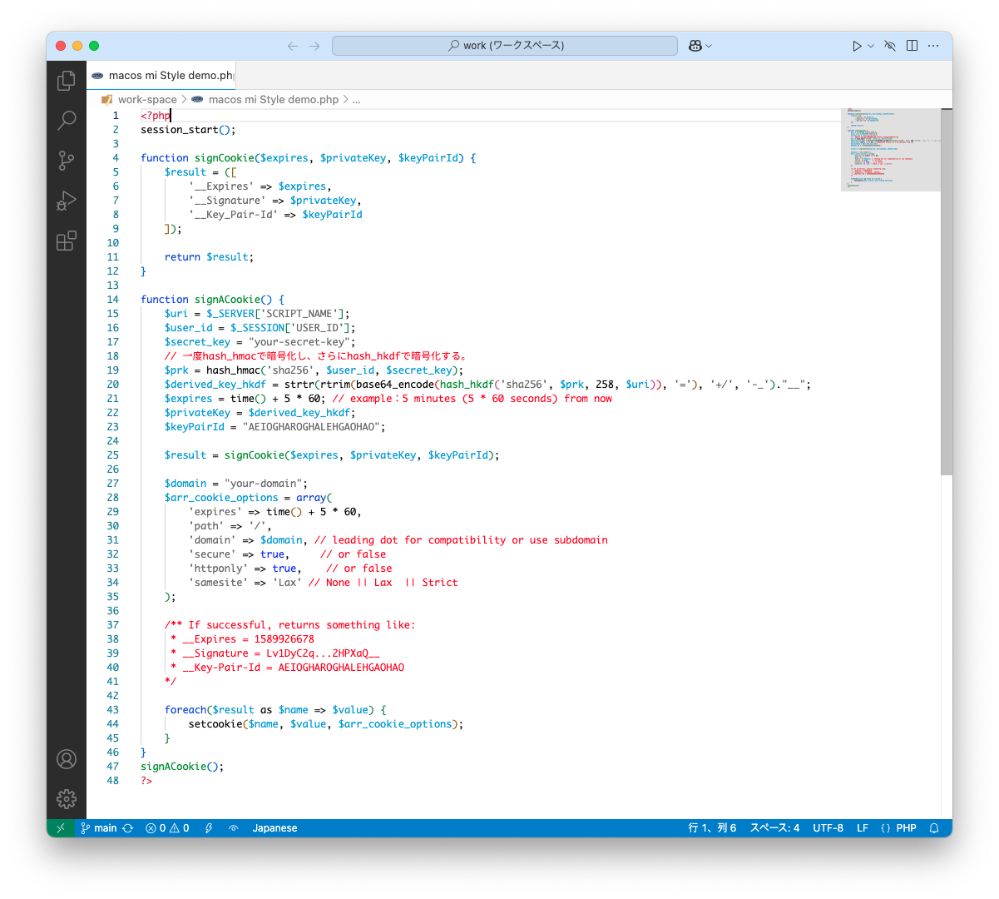
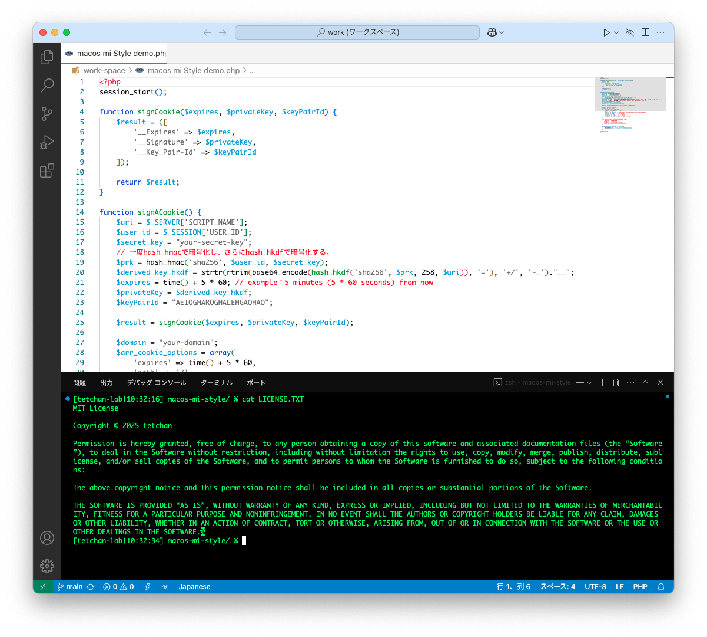
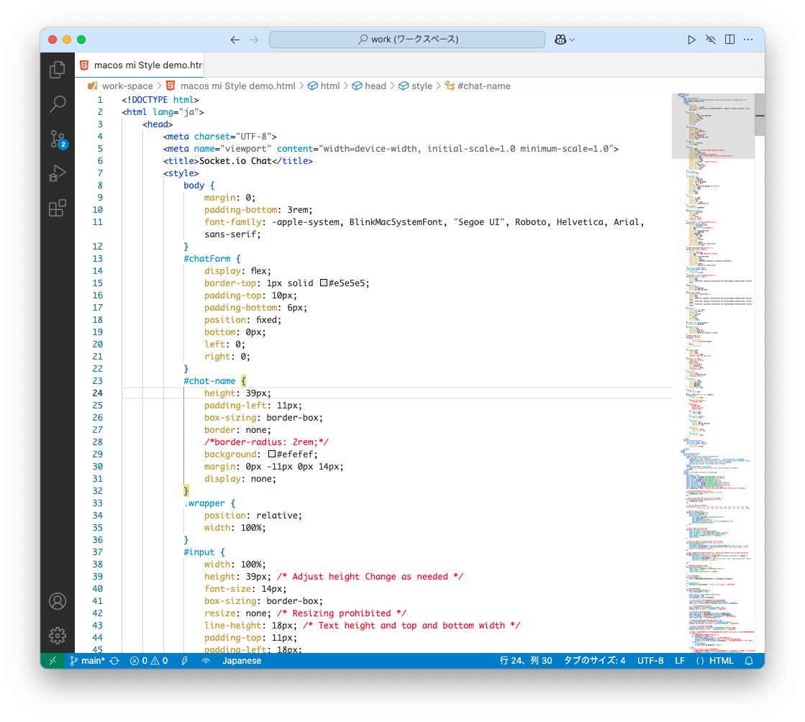
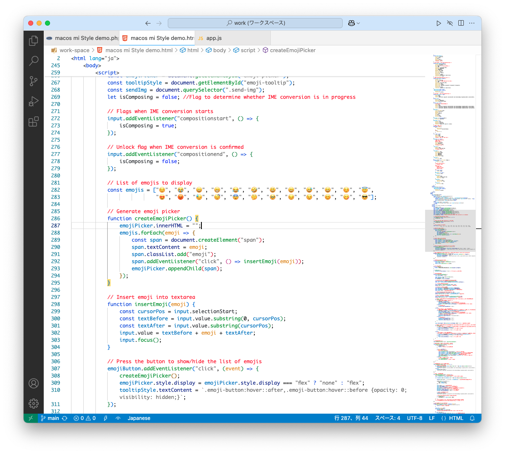
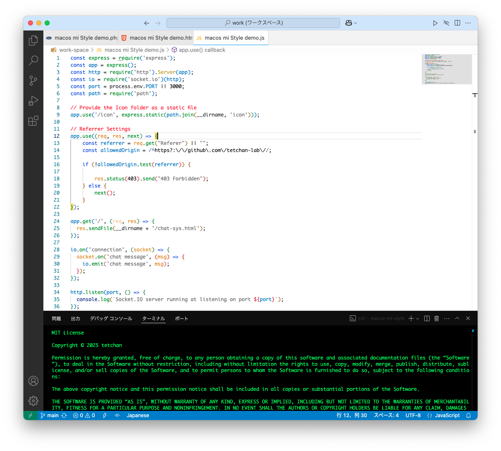

# macOS mi Style
 
このテーマは、macOS用 日本語テキストエディタ **mi** のスタイルと**ダークターミナル**を組み合わせた VSCode 用カラーテーマです。  
This is a combination of my favorite app **“mi”** style color theme and **dark terminal**.

## Features

**日本語入力時の未確定文字の問題を解決！**

VSCode では `"editor.lineHighlightBackground"` の色が特定の色だと、日本語入力時に未確定文字が太くなる問題が発生します。

**解決策**
- **ライトテーマの場合** → `"#f0f0f0"` などの明るい色 or `#00000000`（完全透明）
- **ダークテーマの場合** → `"#202020"` などの暗い色 or `#00000000`（完全透明）

#### **🚀 本テーマではこの問題を完全解決済み！**
**✅ ライト・ダークどちらのテーマでも安心して使えます！**

## Screenshot
**PHP**

**HTML/CSS**

**HTML/JavaScript**

**JavaScript**

## インストール方法
1. VSCode の拡張機能タブを開く。
2. `macOS mi Style` を検索する。
3. インストールボタンをクリックする。

## 使用方法
1. メニューから「表示」→「コマンドパレット」を選択。
2. `Preferences: Color Theme` と入力して選択。
3. `macOS mi Style` を選ぶ。

## 貢献方法
バグ報告や機能提案は、Issue や Pull Request を通じてお願いします。

## ライセンス
このプロジェクトは MIT ライセンスの下で公開されています。

## About mi

- **[macOS 用 日本語テキストエディタ mi](https://www.mimikaki.net/)**

